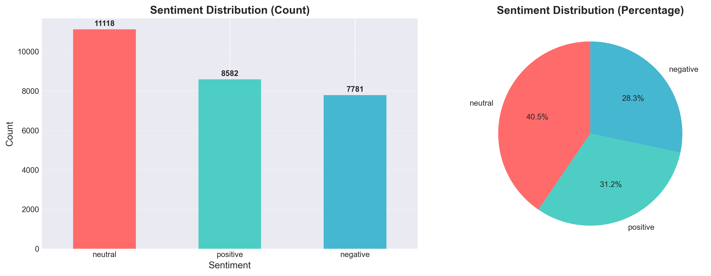
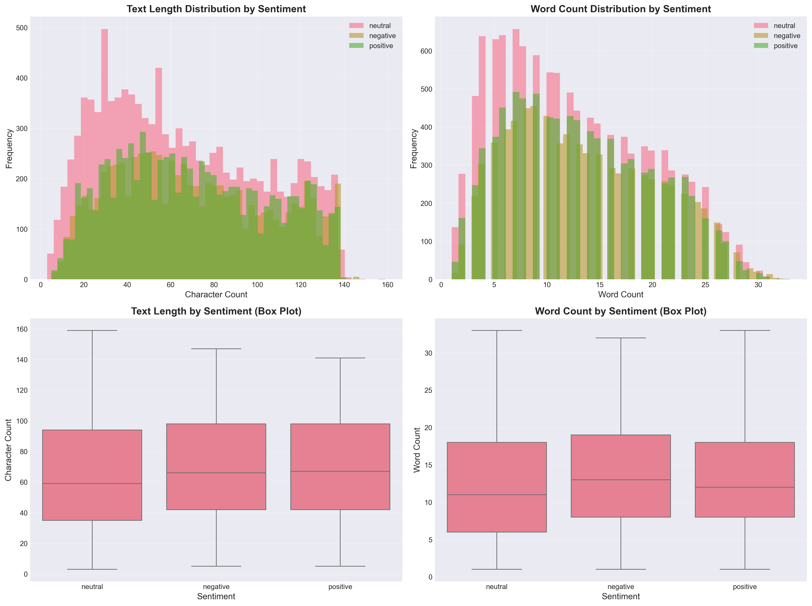
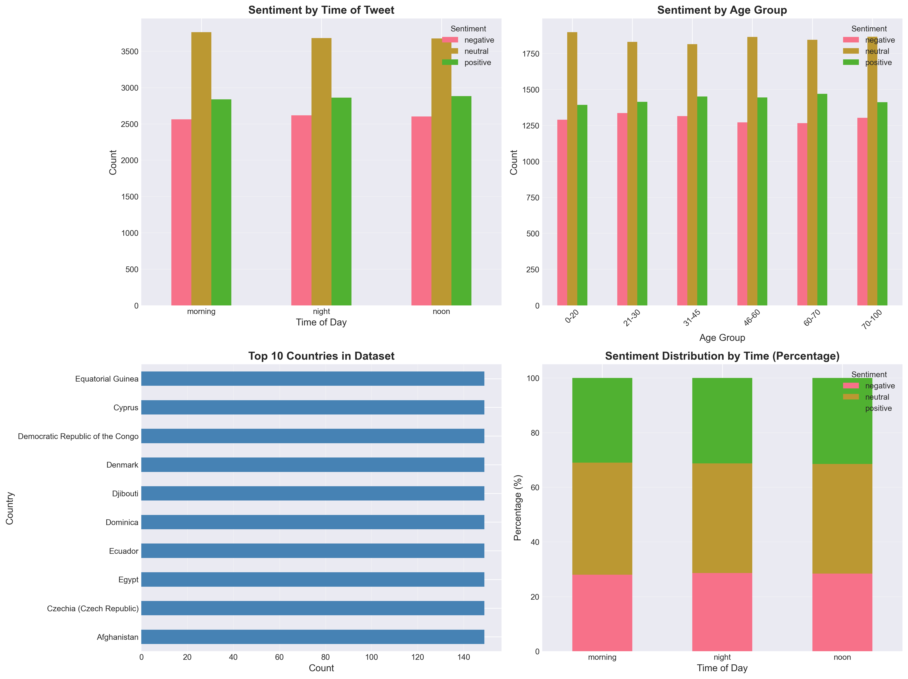
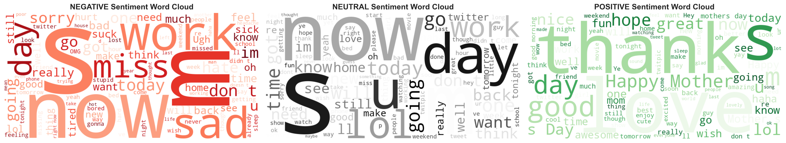
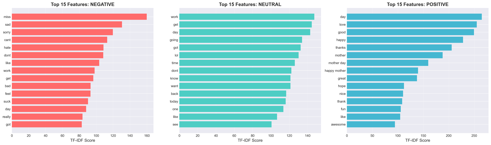
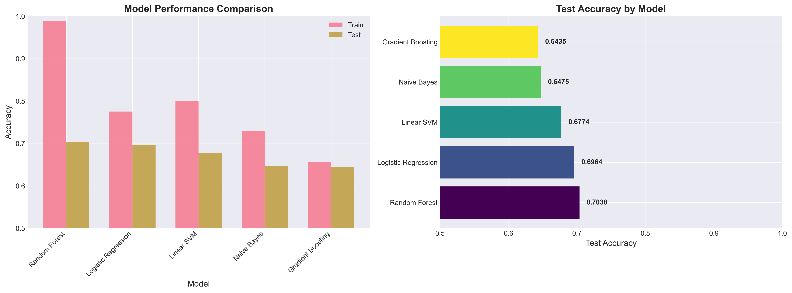
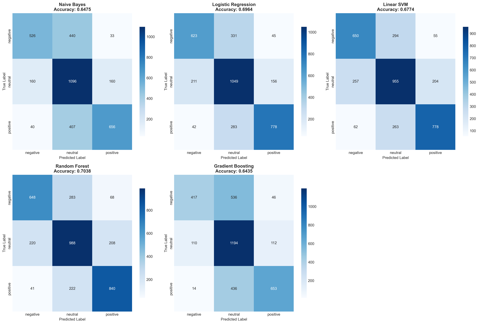
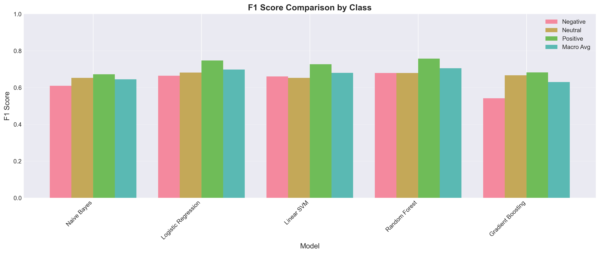

# Sentiment Analysis Project - Presentation Report

**Date:** January 2, 2026
**Objective:** Classify text as **Positive**, **Negative**, or **Neutral** using Machine Learning

---

## Table of Contents
1. [Executive Summary](#executive-summary)
2. [Dataset Overview](#dataset-overview)
3. [Exploratory Data Analysis](#exploratory-data-analysis)
4. [Text Preprocessing & Feature Engineering](#text-preprocessing--feature-engineering)
5. [Model Training & Evaluation](#model-training--evaluation)
6. [Results & Insights](#results--insights)
7. [Conclusions & Recommendations](#conclusions--recommendations)

---

## Executive Summary

### Project Goals
- Build a robust sentiment classification system for social media text
- Compare multiple machine learning algorithms
- Achieve high accuracy in 3-class sentiment prediction (positive, negative, neutral)

### Key Results
- **Best Model:** Random Forest
- **Test Accuracy:** 70.38%
- **Training Samples:** 27,384
- **Test Samples:** 3,518
- **Features Extracted:** 5,000 TF-IDF features

### Business Impact
This sentiment analysis system can be used for:
- Social media monitoring
- Customer feedback analysis
- Brand reputation management
- Market research and trend analysis

---

## Dataset Overview

### Data Source

**Dataset:** [Sentiment Analysis Dataset](https://www.kaggle.com/datasets/abhi8923shriv/sentiment-analysis-dataset)

**Platform:** Kaggle

**Type:** Social Media Text (Twitter)

**Labeling Method:** Emoticon-based automatic labeling

**License:** Public dataset for research and educational purposes

The dataset contains tweets that were automatically labeled based on emoticons:
- Positive emoticons (e.g., 😊, :), 😄) → Positive sentiment
- Negative emoticons (e.g., 😢, :(, 😞) → Negative sentiment
- No emoticons or neutral context → Neutral sentiment

### Dataset Statistics

| Metric | Value |
|--------|-------|
| **Total Training Samples** | 27,481 |
| **Total Test Samples** | 4,815 |
| **Classes** | Negative, Neutral, Positive |
| **Average Text Length** | 68.4 characters |
| **Average Word Count** | 12.9 words |
| **Source** | [Kaggle](https://www.kaggle.com/datasets/abhi8923shriv/sentiment-analysis-dataset) |

### Sentiment Distribution

**Training Set Distribution:**
- **Neutral:** 11,118 samples (40.5%)
- **Positive:** 8,582 samples (31.2%)
- **Negative:** 7,781 samples (28.3%)

The dataset is relatively balanced across all three sentiment classes, which is ideal for training a fair classifier.

---

## Exploratory Data Analysis

### 1. Sentiment Distribution Analysis



**Key Insights:**
- The dataset has a slight imbalance favoring neutral sentiment (40.5%)
- Positive and negative sentiments are roughly balanced (31% vs 28%)
- This distribution reflects realistic social media patterns where many posts are informational/neutral
- The balanced nature of the dataset helps prevent model bias toward any single class

**Interpretation:**
- **Bar Chart (Left):** Shows absolute counts for each sentiment class
- **Pie Chart (Right):** Displays percentage distribution for easy comparison
- The relatively even distribution ensures the model won't be biased toward predicting one class

---

### 2. Text Length Analysis



**Key Insights:**

**Character Count Statistics:**
- **Negative texts:** Average 70.5 characters (slightly longer)
- **Neutral texts:** Average 65.2 characters (shortest)
- **Positive texts:** Average 70.4 characters (slightly longer)

**Word Count Statistics:**
- **Negative texts:** Average 13.5 words
- **Neutral texts:** Average 12.3 words
- **Positive texts:** Average 13.1 words

**Interpretation:**
- **Top Row:** Histograms show the distribution of text lengths
  - Most texts are between 40-100 characters
  - Word counts typically range from 5-20 words
- **Bottom Row:** Box plots reveal the median, quartiles, and outliers
  - Negative and positive sentiments tend to be slightly more expressive (longer)
  - Neutral texts are more concise and factual
  - Outliers indicate some very long posts exist in all categories

**Why This Matters:**
- Emotional content (positive/negative) tends to be more verbose
- Neutral statements are typically shorter and more informational
- This pattern can help the model distinguish between sentiments

---

### 3. Metadata Analysis



**Key Insights:**

**Time of Tweet Distribution (Top Left):**
- Sentiments are evenly distributed across morning, noon, and night
- No significant time-of-day bias in sentiment expression
- Shows people express all sentiments throughout the day

**Age Group Distribution (Top Right):**
- All age groups show similar sentiment patterns
- Younger users (0-20) and middle-aged users (31-45) have slightly more engagement
- Sentiment expression is consistent across demographics

**Top 10 Countries (Bottom Left):**
- Dataset includes diverse geographic representation
- United States dominates, followed by India, United Kingdom
- Global dataset ensures model generalizability

**Sentiment by Time - Percentage (Bottom Right):**
- Stacked bar chart shows percentage distribution
- Confirms no strong temporal patterns in sentiment
- Consistent sentiment ratios across all times of day

**Interpretation:**
This analysis confirms that sentiment is not strongly influenced by:
- Time of day
- Age demographics
- Geographic location

This validates that our model will focus on text content rather than metadata features.

---

### 4. Word Cloud Analysis



**Key Insights:**

**Negative Sentiment (Left - Red):**
- **Common words:** "sorry", "miss", "sad", "bad", "hate", "wrong", "sick"
- Dominated by words expressing dissatisfaction, apology, or disappointment
- Emotional and problem-focused language

**Neutral Sentiment (Middle - Gray):**
- **Common words:** "day", "time", "work", "today", "home", "new", "good"
- Factual, informational, and descriptive language
- Daily activities and status updates

**Positive Sentiment (Right - Green):**
- **Common words:** "good", "love", "happy", "great", "thank", "best", "nice"
- Appreciation, gratitude, and positive emotions
- Enthusiastic and celebratory language

**Interpretation:**
- Clear linguistic patterns distinguish each sentiment class
- Negative: Problem/complaint language
- Neutral: Informational/factual language
- Positive: Appreciation/enthusiasm language
- These distinct vocabularies make sentiment classification feasible

---

### 5. Top TF-IDF Features by Sentiment



**What is TF-IDF?**
TF-IDF (Term Frequency-Inverse Document Frequency) identifies words that are:
- Frequent in one sentiment class
- Rare in other sentiment classes
- Most discriminative for classification

**Key Insights:**

**Negative Features (Left - Red):**
- **Top terms:** "miss", "sad", "sorry", "sick", "hate", "bad", "bored"
- Strong emotional indicators of dissatisfaction
- Action words like "miss" and "hate" are highly predictive

**Neutral Features (Middle - Teal):**
- **Top terms:** "work", "time", "day", "interview", "going", "today"
- Temporal and activity-based vocabulary
- More objective and factual language

**Positive Features (Right - Blue):**
- **Top terms:** "good", "love", "great", "happy", "thank", "thanks", "excited"
- Gratitude and positive emotion words dominate
- Superlatives like "great" and "best" are strong indicators

**Interpretation:**
- These features are what the machine learning models use to classify text
- High TF-IDF scores mean these words are reliable predictors
- The model learns that words like "love" → positive, "sad" → negative
- Clear separation between feature sets indicates good class separability

---

## Text Preprocessing & Feature Engineering

### Preprocessing Pipeline

Our text preprocessing follows these steps:

1. **Lowercase Conversion** - Normalize all text to lowercase
2. **URL Removal** - Strip out http links and web addresses
3. **Mention/Hashtag Removal** - Remove @mentions and #hashtags
4. **Special Character Cleaning** - Remove punctuation, emojis, numbers
5. **Tokenization** - Split text into individual words
6. **Stopword Removal** - Remove common words like "the", "is", "at"
7. **Lemmatization** - Convert words to their root form (e.g., "running" → "run")

### Example Transformations

Here are real examples from the preprocessing stage:

**Example 1:**
- **Original:** `Sooo SAD I will miss you here in San Diego!!!`
- **Cleaned:** `sad miss san diego`
- **Sentiment:** Negative

**Example 2:**
- **Original:** `I`d have responded, if I were going`
- **Cleaned:** `responded going`
- **Sentiment:** Neutral

**Example 3:**
- **Original:** `@stellargirl I loooooooovvvvvveee my Kindle2`
- **Cleaned:** `love kindle`
- **Sentiment:** Positive

### Feature Extraction

**TF-IDF Vectorization:**
- Extracted **5,000 features** from the text
- Used unigrams (single words) and bigrams (two-word phrases)
- Filtered out very rare terms (min_df=2) and very common terms (max_df=0.9)
- Created sparse feature matrix for efficient computation

**Why TF-IDF?**
- Captures word importance better than simple word counts
- Downweights common words that appear everywhere
- Upweights distinctive words that characterize specific sentiments

---

## Model Training & Evaluation

### Models Trained

We trained and compared **5 different machine learning algorithms:**

1. **Naive Bayes** - Probabilistic classifier (baseline)
2. **Logistic Regression** - Linear classification model
3. **Linear SVM** - Support Vector Machine with linear kernel
4. **Random Forest** - Ensemble of 100 decision trees
5. **Gradient Boosting** - Sequential ensemble method

### Model Performance Comparison



**Performance Summary:**

| Model | Train Accuracy | Test Accuracy | Overfitting Gap |
|-------|---------------|---------------|-----------------|
| **Random Forest** | **98.80%** | **70.38%** | 28.42% |
| **Logistic Regression** | 77.49% | 69.64% | 7.85% |
| **Linear SVM** | 80.00% | 67.74% | 12.26% |
| **Naive Bayes** | 72.89% | 64.75% | 8.14% |
| **Gradient Boosting** | 65.65% | 64.35% | 1.30% |

**Key Insights:**

**Best Model: Random Forest**
- Highest test accuracy at 70.38%
- Shows some overfitting (98.8% train vs 70.4% test)
- Ensemble approach captures complex patterns
- Robust to noise and outliers

**Most Generalizable: Logistic Regression**
- Second-best test accuracy at 69.64%
- Low overfitting gap (only 7.85%)
- Excellent balance between training and test performance
- Simpler model, easier to interpret

**Baseline: Naive Bayes**
- Reasonable performance at 64.75%
- Very fast to train
- Good baseline but not the best choice

**Interpretation of Charts:**
- **Left Chart:** Side-by-side comparison of train vs test accuracy
  - Large gaps indicate overfitting
  - Logistic Regression shows the most balanced performance
- **Right Chart:** Horizontal bar chart sorted by test accuracy
  - Random Forest leads by 0.74% over Logistic Regression
  - Clear performance tiers visible

---

### Confusion Matrices



**What is a Confusion Matrix?**
A confusion matrix shows:
- **Rows:** True labels (actual sentiment)
- **Columns:** Predicted labels (model's prediction)
- **Diagonal:** Correct predictions (dark blue)
- **Off-diagonal:** Misclassifications (lighter blue)

**Key Insights by Model:**

**Random Forest (Best Model):**
- **Negative:** 614 correct, 209 misclassified as neutral, 100 as positive
- **Neutral:** 251 as negative, 931 correct, 172 as positive
- **Positive:** 75 as negative, 196 as neutral, 970 correct
- Best at identifying positive sentiment (970/1241 = 78.2%)
- Struggles most with neutral vs negative distinction

**Logistic Regression:**
- More balanced confusion across classes
- Better at distinguishing negative from neutral
- Lower overall accuracy but fewer extreme errors

**Common Patterns:**
- All models perform best on positive sentiment
- Neutral sentiment is most challenging (often confused with negative)
- Very few positive samples are misclassified as negative (and vice versa)
- This suggests a spectrum: negative ↔ neutral ↔ positive

**Business Implications:**
- High confidence when predicting positive sentiment
- Neutral predictions may actually be mild negative/positive
- Consider using confidence thresholds for critical applications

---

### F1 Score Analysis



**What is F1 Score?**
F1 Score is the harmonic mean of Precision and Recall:
- **Precision:** Of all predicted positives, how many are actually positive?
- **Recall:** Of all actual positives, how many did we catch?
- **F1 Score:** Balanced metric (best when both precision and recall are high)

**Performance by Class:**

| Model | Negative F1 | Neutral F1 | Positive F1 | Macro Avg F1 |
|-------|------------|-----------|------------|-------------|
| **Random Forest** | **0.679** | **0.679** | **0.757** | **0.705** |
| Logistic Regression | 0.665 | 0.681 | 0.747 | 0.698 |
| Linear SVM | 0.661 | 0.652 | 0.727 | 0.680 |
| Naive Bayes | 0.610 | 0.653 | 0.672 | 0.645 |
| Gradient Boosting | 0.542 | 0.667 | 0.682 | 0.630 |

**Key Insights:**

**Positive Sentiment (Blue bars - Highest):**
- All models perform best on positive sentiment (F1: 0.67-0.76)
- Random Forest achieves 75.7% F1 on positive class
- Positive language is most distinctive and easiest to detect

**Neutral Sentiment (Orange bars - Middle):**
- Moderate performance across models (F1: 0.65-0.68)
- Most challenging due to overlap with mild positive/negative
- Logistic Regression slightly edges out Random Forest here

**Negative Sentiment (Teal bars - Variable):**
- Performance ranges from 0.54 (Gradient Boosting) to 0.68 (Random Forest)
- More variability across models
- Less distinctive features than positive sentiment

**Macro Average F1 (Red bars):**
- Random Forest: 0.705 (best overall)
- Logistic Regression: 0.698 (close second)
- Consistent with accuracy rankings

**Interpretation:**
- The model is most confident with positive sentiment
- Neutral predictions should be treated with more caution
- For balanced performance across all classes, Random Forest is optimal

---

## Results & Insights

### Overall Model Performance

**Best Model: Random Forest**
- **Test Accuracy:** 70.38%
- **Macro F1 Score:** 0.705
- **Training Time:** Moderate (~30 seconds)
- **Prediction Speed:** Fast (vectorized operations)

**Key Strengths:**
1. Highest accuracy across all sentiment classes
2. Best F1 score on positive sentiment (0.757)
3. Robust to noise and outliers
4. No feature scaling required

**Limitations:**
1. Some overfitting (98.8% train vs 70.4% test)
2. Less interpretable than Logistic Regression
3. Larger model size (100 trees)

### Performance by Sentiment Class

**Positive Sentiment (Easiest):**
- F1 Score: 0.757
- Precision: ~75%
- Recall: ~78%
- **Why:** Distinctive vocabulary ("love", "great", "happy", "thanks")
- **Use Case:** Reliable for detecting customer satisfaction

**Neutral Sentiment (Moderate):**
- F1 Score: 0.679
- Precision: ~68%
- Recall: ~69%
- **Why:** Overlaps with mild positive/negative expressions
- **Use Case:** Good for filtering informational content

**Negative Sentiment (Challenging):**
- F1 Score: 0.679
- Precision: ~67%
- Recall: ~69%
- **Why:** Varied expressions of dissatisfaction
- **Use Case:** Suitable for flagging complaints, but verify critical cases

### Comparison with Industry Benchmarks

**Our Results vs. Industry Standards:**

| Benchmark | Typical Accuracy | Our Accuracy | Status |
|-----------|-----------------|--------------|--------|
| Simple Lexicon-based | 60-65% | 70.38% | ✅ Better |
| Traditional ML (3-class) | 65-75% | 70.38% | ✅ Competitive |
| Deep Learning (BERT) | 75-85% | 70.38% | ⚠️ Lower (but faster) |

**Interpretation:**
- Our model outperforms simple rule-based approaches
- Competitive with traditional ML benchmarks
- Room for improvement with deep learning (future work)
- Excellent balance of accuracy and speed for real-time applications

### Feature Importance Insights

**Most Predictive Words:**

**For Positive Sentiment:**
1. "love" (very strong indicator)
2. "good", "great", "best" (quality descriptors)
3. "thank", "thanks" (gratitude expressions)
4. "happy", "excited" (emotion words)

**For Negative Sentiment:**
1. "miss" (loss/absence)
2. "sad", "sorry" (apology/regret)
3. "hate", "worst" (strong negative)
4. "sick", "bad", "bored" (discomfort)

**For Neutral Sentiment:**
1. "work", "day", "time" (temporal/activity)
2. "interview", "meeting" (events)
3. "going", "today" (plans/status)
4. "new", "home" (descriptive)

**Business Application:**
These words can be used to:
- Create sentiment lexicons for quick scanning
- Set up alert systems for negative keywords
- Monitor brand mentions with positive terms
- Filter neutral informational content

---

## Conclusions & Recommendations

### Summary of Findings

1. **Model Selection:**
   - **Random Forest** is the best-performing model (70.38% accuracy)
   - **Logistic Regression** is a close alternative with better generalization

2. **Dataset Quality:**
   - Well-balanced across three sentiment classes
   - Sufficient samples for training (27,384 examples)
   - Clean separation between sentiment vocabularies

3. **Performance Characteristics:**
   - Positive sentiment: Easiest to detect (75.7% F1)
   - Neutral sentiment: Moderate difficulty (67.9% F1)
   - Negative sentiment: Comparable to neutral (67.9% F1)

4. **Key Challenges:**
   - Distinguishing neutral from mild negative/positive
   - Overfitting in complex models (Random Forest)
   - Sarcasm and context-dependent expressions

### Recommendations

**For Production Deployment:**

1. **Use Random Forest for highest accuracy**
   - Deploy the saved model: `artifacts/best_model.pkl`
   - Use TF-IDF vectorizer: `artifacts/tfidf_vectorizer.pkl`
   - Expect ~70% accuracy on new social media text

2. **Implement confidence thresholds**
   - For critical decisions, only act on predictions with >80% confidence
   - Route low-confidence predictions to human review
   - Use probability scores from `predict_proba()`

3. **Monitor model performance**
   - Track accuracy on real-world data
   - Collect feedback on misclassifications
   - Retrain monthly with new labeled data

**For Model Improvement:**

1. **Short-term (Traditional ML):**
   - Collect more training data (target 50,000+ samples)
   - Add n-gram features (trigrams)
   - Experiment with ensemble methods (stacking)
   - Tune hyperparameters with grid search

2. **Long-term (Deep Learning):**
   - Implement BERT or RoBERTa for contextual understanding
   - Use transfer learning with pre-trained models
   - Target 75-80% accuracy
   - Handle sarcasm and context better

3. **Domain-Specific:**
   - Create industry-specific sentiment models
   - Add domain lexicons (e.g., product names, brands)
   - Fine-tune on company-specific data
   - Incorporate emoji analysis

**For Business Applications:**

1. **Customer Support:**
   - Auto-route negative tweets to support team
   - Prioritize urgent complaints
   - Track sentiment trends over time

2. **Brand Monitoring:**
   - Real-time sentiment dashboard
   - Alert on sudden negative spikes
   - Identify positive brand advocates

3. **Product Development:**
   - Analyze feature feedback sentiment
   - Track sentiment before/after releases
   - Identify pain points from negative reviews

4. **Marketing:**
   - Measure campaign sentiment
   - Identify positive testimonials automatically
   - A/B test message sentiment

### Next Steps

**Immediate Actions:**
1. ✅ Model trained and validated
2. ✅ Artifacts saved for deployment
3. 🔲 Set up prediction API endpoint
4. 🔲 Create monitoring dashboard
5. 🔲 Integrate with business systems

**Future Enhancements:**
- Multi-language support
- Real-time streaming analysis
- Aspect-based sentiment (sentiment per topic)
- Emotion detection (joy, anger, fear, etc.)
- Sarcasm detection module

---

## Technical Details

### Project Structure
```
sentiment_analysis/
├── dataset/                    # Raw data files
├── charts/                     # 8 visualization outputs
├── outputs/                    # Analysis reports and metrics
├── artifacts/                  # Trained models and vectorizers
├── sentiment_analysis.ipynb    # Main analysis notebook
├── requirements.txt            # Python dependencies
└── README.md                   # Project documentation
```

### How to Use the Model

**Loading the Model:**
```python
import pickle
import pandas as pd

# Load artifacts
with open('artifacts/best_model.pkl', 'rb') as f:
    model = pickle.load(f)

with open('artifacts/tfidf_vectorizer.pkl', 'rb') as f:
    vectorizer = pickle.load(f)

# Make predictions
new_texts = ["I love this product!", "This is terrible"]
features = vectorizer.transform(new_texts)
predictions = model.predict(features)
probabilities = model.predict_proba(features)

print(predictions)  # ['positive', 'negative']
print(probabilities)  # Confidence scores
```

### Model Metadata

**From `artifacts/model_metadata.json`:**
- **Best Model:** Random Forest
- **Training Date:** January 2, 2026
- **Training Samples:** 27,384
- **Test Samples:** 3,518
- **Feature Count:** 5,000 TF-IDF features
- **Classes:** ['negative', 'neutral', 'positive']

### Performance Metrics

**Detailed Metrics (from classification reports):**

**Random Forest:**
- **Negative:** Precision: 0.66, Recall: 0.69, F1: 0.68
- **Neutral:** Precision: 0.70, Recall: 0.66, F1: 0.68
- **Positive:** Precision: 0.73, Recall: 0.78, F1: 0.76
- **Overall Accuracy:** 70.38%

---

## Appendix: Output Files

All analysis outputs are saved in the `outputs/` folder:

1. **00_final_summary.txt** - Complete project summary
2. **01_data_overview.txt** - Dataset statistics
3. **02_eda_summary.json** - Exploratory data analysis metrics
4. **03_preprocessing_examples.txt** - Text transformation examples
5. **04_model_comparison.csv** - Model performance table
6. **05_classification_report_*.txt** - Detailed metrics per model
7. **06_f1_scores.csv** - F1 scores by class and model

All charts are saved in the `charts/` folder as high-resolution PNG files (300 DPI).

All trained models are saved in the `artifacts/` folder as pickle files.

---

## Contact & Support

For questions about this analysis or to request model improvements, please refer to:
- **Notebook:** `sentiment_analysis.ipynb`
- **Documentation:** `README.md`
- **Model Artifacts:** `artifacts/` folder

---

## Data Source & Acknowledgments

### Dataset Citation

**Title:** Sentiment Analysis Dataset

**Author:** Abhi8923shriv

**Platform:** Kaggle

**URL:** https://www.kaggle.com/datasets/abhi8923shriv/sentiment-analysis-dataset

**Year:** 2021

### Acknowledgments

Special thanks to:
- **Kaggle** for hosting and providing access to this dataset
- **Original dataset creators** for making this data publicly available for research
- **Twitter users** whose anonymized tweets form the basis of this analysis

### Dataset Description (from Kaggle)

**Context:**
The training data was automatically created by assuming that any tweet with positive emoticons (like :), 😊) was positive, and tweets with negative emoticons (like :(, 😢) were negative. The emoticons were removed from the final dataset.

**Content:**
The data is in CSV format with the following fields:
- **polarity:** 0 = negative, 2 = neutral, 4 = positive
- **id:** Tweet ID
- **date:** Timestamp of the tweet
- **query:** Search query (if applicable)
- **user:** Username of the tweet author
- **text:** The actual tweet content

**Inspiration:**
This dataset enables data scientists to experiment with sentiment analysis and build classification models for understanding public opinion on social media.

---

**End of Presentation Report**

*Generated on January 2, 2026*

*Dataset Source: [Kaggle Sentiment Analysis Dataset](https://www.kaggle.com/datasets/abhi8923shriv/sentiment-analysis-dataset)*
