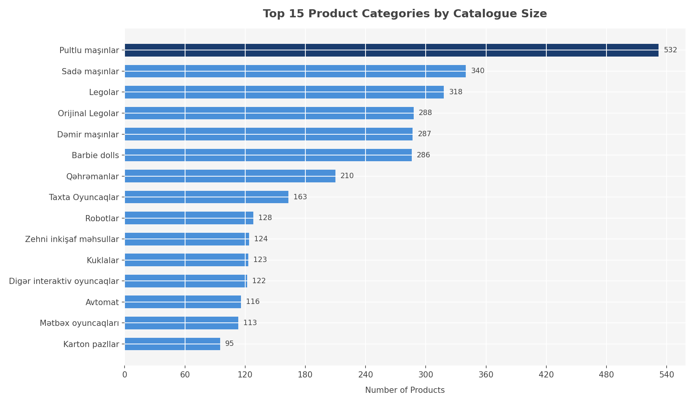
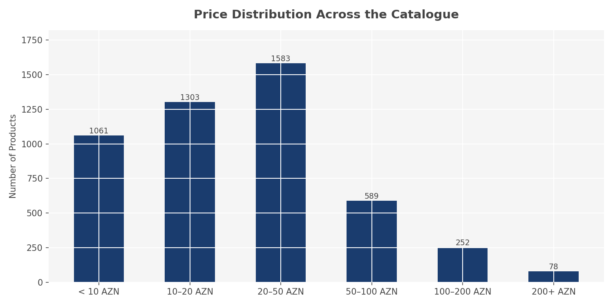
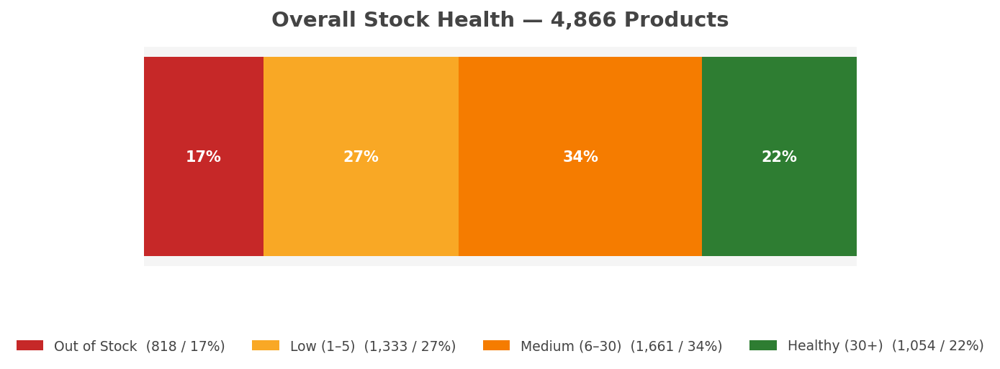
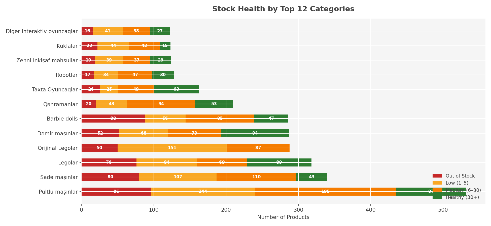
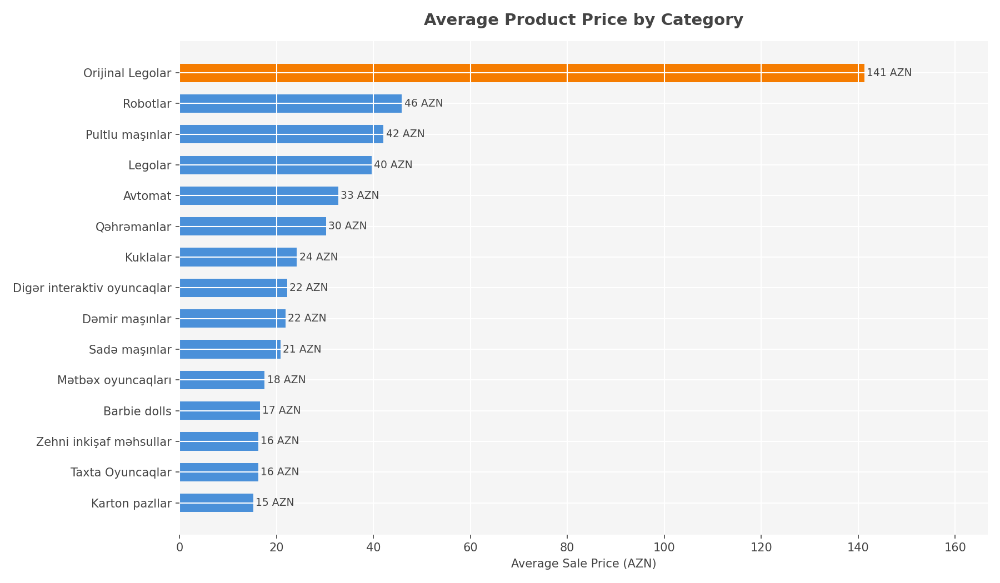
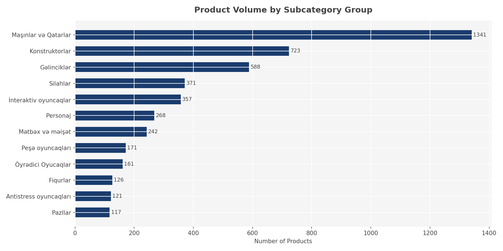
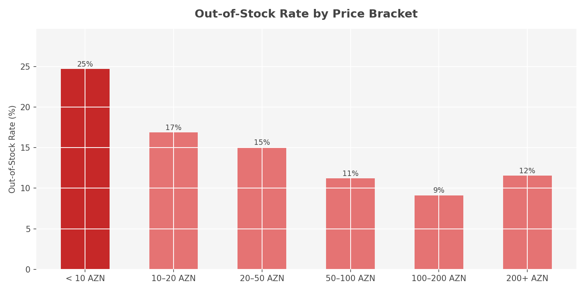
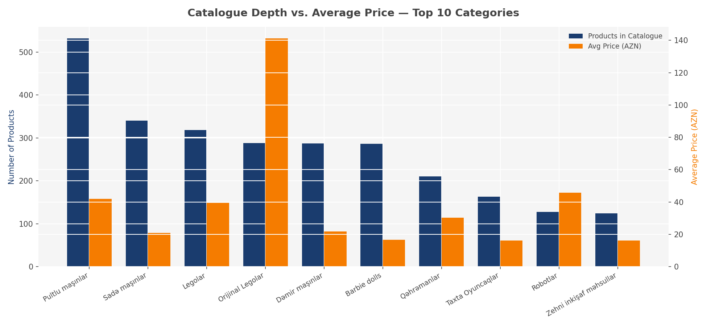

# SuperToys.az — Product Catalogue Business Insights

- > **Data source:** supertoys.az/oyuncaqlar-105 · 
- > **Total products analysed:** 4,866 · 
- > **Categories:** 50+

---

## Executive Summary

The SuperToys.az toy catalogue spans nearly **4,900 products** across more than 50 categories, with an average selling price of **36 AZN** and a median of **20 AZN**. The business has a meaningful stock risk exposure: **44% of the catalogue** is either out of stock or critically low (1–5 units). Vehicles (remote-control and simple), LEGO sets, and Barbie dolls dominate shelf space. Premium segments such as Original LEGOs and kitchens carry the highest average prices and deserve dedicated restocking priority.

---

## 1. What Sells the Most Space — Category Catalogue Size

**What the chart shows:**
Remote-control cars (Pultlu maşınlar) lead the catalogue with **532 products**, followed by simple toy cars (340), LEGOs (318), Original LEGOs (288), and die-cast cars (287). These five vehicle and construction categories alone account for **36% of all listed products**.

**Why it matters:**
A wide catalogue in a category signals supplier relationships, consumer demand, and internal investment. Vehicles and construction toys are clearly the strategic core of the business. Any supply disruption in these categories would have outsized impact on the store's appeal and revenue.

**Recommended action:**
Protect these flagship categories through priority reordering, supplier diversification, and featured placement on the website.

---

## 2. Where Products Sit on the Price Ladder

**What the chart shows:**
The majority of products (1,583) are priced between **20–50 AZN**, forming the commercial sweet spot. The **10–20 AZN** range is the second largest (1,303 products), and budget items under 10 AZN account for over 1,000 listings. Only 78 products are priced above 200 AZN.

**Why it matters:**
SuperToys.az operates predominantly in the **affordable-to-mid-range segment**. Approximately 79% of the catalogue is priced below 50 AZN, positioning the store well for impulse purchases and gift-buying. The thin premium tier (200+ AZN) represents a potential growth opportunity — if demand exists, widening this range could increase average order value.

**Recommended action:**
Maintain depth in the 20–50 AZN band; evaluate demand signals before expanding the 200+ AZN tier.

---

## 3. Stock Health — A Significant Risk

**What the chart shows:**
Across all 4,866 products:
- **17% are out of stock** (818 products) — invisible to buyers, zero revenue potential
- **27% are critically low** (1–5 units, 1,333 products) — at high risk of going out of stock imminently
- **34% are in medium supply** (6–30 units)
- Only **22% are in healthy supply** (30+ units)

**Why it matters:**
**Nearly half the catalogue cannot reliably fulfil customer demand.** This is a direct revenue leak — customers who land on empty pages either leave or switch to a competitor. The low-stock tier is a ticking clock: without replenishment, these 1,333 items will shift into the out-of-stock column, further degrading availability.

**Recommended action:**
Implement a reorder-trigger policy. All items with fewer than 10 units should be automatically flagged for purchasing review. Products at zero stock should be hidden from or deprioritised in search results until restocked.

---

## 4. Stock Risk Is Not Evenly Distributed Across Categories

**What the chart shows:**
**Barbie dolls** carry the highest out-of-stock rate among major categories at **31%** — nearly 1 in 3 Barbie products is unavailable. Simple toy cars (Sadə maşınlar) and LEGOs both sit at **24%** out-of-stock. Heroes/characters (Qəhrəmanlar) and robots have the best stock health among the top 12 categories.

**Why it matters:**
Barbie is one of the most globally recognised toy brands. A 31% out-of-stock rate in this category almost certainly translates to lost sales, particularly around seasonal peaks (birthdays, New Year, holidays). LEGOs at 24% present a similar risk in a high-spend segment.

**Recommended action:**
Barbie and LEGO restocking should be treated as urgent. These are brand-loyal categories where customers have a specific product in mind — they will go elsewhere if it is unavailable.

---

## 5. The Premium Categories Carry Substantially Higher Prices

**What the chart shows:**
**Original LEGOs average 141 AZN** — nearly 4× the catalogue average. Play kitchens (Mətbəxlər) average 121 AZN, followed by NERF (93 AZN) and Original Barbie (86 AZN). Budget categories such as simple cars and puzzles average under 20 AZN.

**Why it matters:**
A small number of transactions in premium categories can contribute disproportionately to revenue. A customer buying one Original LEGO set spends as much as seven customers buying a budget car. This means stockouts in premium segments cost more revenue per missed sale than stockouts in budget categories.

**Recommended action:**
Premium categories (Original LEGO, play kitchens, Original Barbie) warrant dedicated stock management, potentially separate safety stock targets, and featured promotion to drive high-value basket sizes.

---

## 6. Subcategory Structure — Where Volume Concentrates

**What the chart shows:**
At the broader subcategory level, **Vehicles & Trains** (1,341 products) accounts for more than a quarter of the entire catalogue. Constructors (723) and Dolls (588) round out the top three. These three groups together represent **55% of all products**.

**Why it matters:**
The business has made a clear structural bet on vehicles, construction, and dolls. This focus enables depth (many options per subcategory) but also concentrates risk — if supplier relationships in any of these three groups are disrupted, the impact is severe.

**Recommended action:**
Consider strategic catalogue expansion in underdeveloped but growing subcategories (e.g., educational toys, interactive toys) to reduce concentration risk and capture broader customer segments.

---

## 7. Out-of-Stock Risk Is Highest in the Budget Segment

**What the chart shows:**
Products priced **under 10 AZN have the highest out-of-stock rate**, followed by the 10–20 AZN bracket. The 20–50 AZN sweet spot is relatively well stocked. Premium items (100+ AZN) have the lowest out-of-stock rates, likely because they are ordered more carefully and in smaller quantities.

**Why it matters:**
Budget products are often impulse purchases or add-ons that boost average order value. Running out of these items disappoints customers who were looking for small, affordable additions. Since these items are low-cost, restocking them is also low-risk — the investment required to bring them back in stock is minimal relative to the revenue and traffic benefit.

**Recommended action:**
Prioritise restocking budget-tier items (<20 AZN) in bulk. High velocity + low cost = high return on reorder investment.

---

## 8. Catalogue Depth vs. Revenue Potential — Top 10 Categories

**What the chart shows:**
This chart contrasts how many products a category has (catalogue depth) with how much those products cost on average. Remote-control cars lead on volume but have a moderate average price. Original LEGOs have far fewer products but an average price 4× higher. Kitchens have the second-highest average price with a small but curated range.

**Why it matters:**
This identifies where **volume-driven revenue** (many low-cost sales) meets **value-driven revenue** (fewer but higher-priced transactions). Both strategies can be profitable, but they require different operational approaches: volume categories need rapid replenishment and high availability; premium categories need careful curation, accurate stock, and strong presentation.

**Recommended action:**
Develop a two-track commercial strategy: (1) scale and maintain availability in high-volume, lower-price categories; (2) invest in presentation, description quality, and stock reliability for premium categories to justify and capture higher margins.

---

## Key Priorities at a Glance

| Priority | Issue | Scale | Action |
|---|---|---|---|
| **Critical** | Out-of-stock products generating zero revenue | 818 products (17%) | Immediate restock or delist |
| **Urgent** | Near-stockout products (1–5 units) | 1,333 products (27%) | Set reorder triggers |
| **High** | Barbie dolls — 31% out of stock | 88 of 286 products | Emergency replenishment |
| **High** | LEGO & Simple Cars — 24% out of stock | ~150 products each | Restock before peak season |
| **Medium** | Budget items (<10 AZN) highest OOS rate | ~1,000 products | Bulk reorder, low cost |
| **Opportunity** | Premium segment (200+ AZN) very thin | 78 products | Evaluate demand for expansion |

---

*Data collected February 2026 from supertoys.az. All prices in AZN.*
